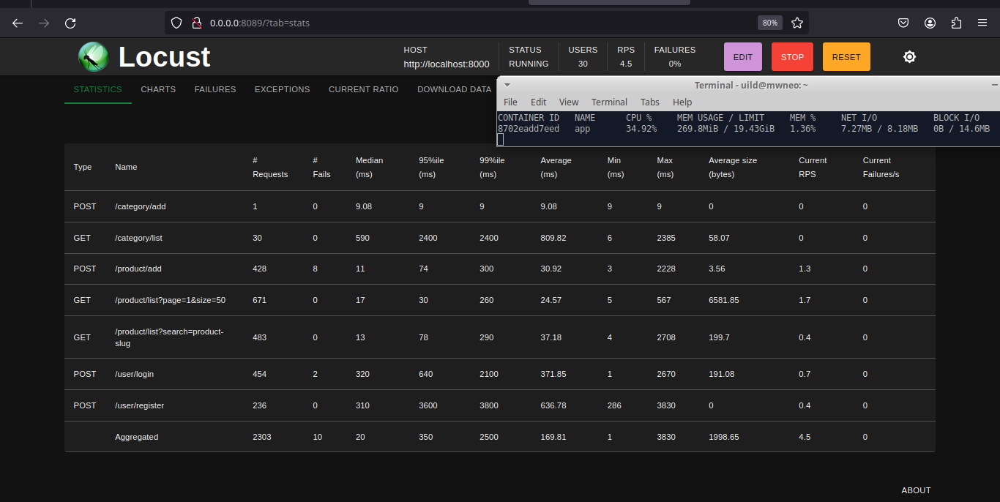
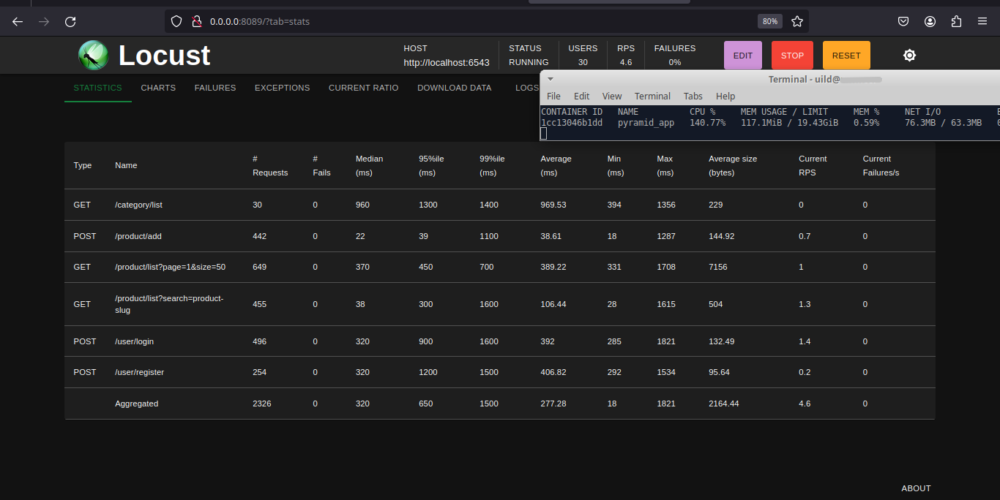

FastApi

Pyramid

#Multilingual Content (Portuguese, English)

Comparação de Desempenho: framework síncrono Pyramid vs. framework assíncrono FastAPI usando Locust

Este documento apresenta uma comparação de desempenho entre os frameworks web Pyramid e FastAPI, utilizando a ferramenta de teste de carga Locust. Os benchmarks incluem vários endpoints, e os resultados são baseados nos tempos de resposta medianos e médios, além do uso de memória.

Test Configuration:

    Number of Users: 30
    Requests per Minute: ~4.5 (Aproximadamente 270 requests por minuto)
    Distribution of Requests:
        Login: 20%
        User Registration: 10%
        Product Listing (GET): 60%
        Add Products (POST): 10%

Métricas do Pyramid:

"/category/list"

    Tempo de Resposta Mediana: 960 ms
    Tempo de Resposta Médio: 969.53 ms

"/product/add"

    Tempo de Resposta Mediana: 22 ms
    Tempo de Resposta Médio: 38.05 ms

"/product/list?page=1&size=50"

    Tempo de Resposta Mediana: 370 ms
    Tempo de Resposta Médio: 388.63 ms

"/product/list?search=product-slug"

    Tempo de Resposta Mediana: 37 ms
    Tempo de Resposta Médio: 103.78 ms

"/user/login"

    Tempo de Resposta Mediana: 330 ms
    Tempo de Resposta Médio: 389.52 ms

"/user/register"

    Tempo de Resposta Mediana: 320 ms
    Tempo de Resposta Médio: 402.75 ms

Uso de Memória

    117.1 MB

Métricas do FastAPI:

"/category/list"

    Tempo de Resposta Mediana: 590 ms
    Tempo de Resposta Médio: 809.82 ms

"/product/add"

    Tempo de Resposta Mediana: 11 ms
    Tempo de Resposta Médio: 30.92 ms

"/product/list?page=1&size=50"

    Tempo de Resposta Mediana: 17 ms
    Tempo de Resposta Médio: 24.17 ms

"/product/list?search=product-slug"

    Tempo de Resposta Mediana: 13 ms
    Tempo de Resposta Médio: 37.18 ms

"/user/login"

    Tempo de Resposta Mediana: 320 ms
    Tempo de Resposta Médio: 371.85 ms

"/user/register"

    Tempo de Resposta Mediana: 310 ms
    Tempo de Resposta Médio: 636.78 ms

Uso de Memória

    269.8 MB

Conclusão:

   	FastAPI geralmente apresenta tempos de resposta mais rápidos em vários endpoints em comparação com o  Pyramid , com vantagens notáveis nos seguintes endpoints:
        "/product/list?page=1&size=50",: FastAPI demonstrou desempenho significativamente melhor, com um tempo de resposta mediana de 17 ms em comparação com os 370 ms do Pyramid.
        "/product/list?search=product-slug": FastAPI superou o Pyramid, alcançando um tempo de resposta mediana de 37 ms, enquanto o FastAPI teve um tempo de resposta mediana de 13 ms.

    O Contudo, o Pyramid demonstra menor uso de memória em comparação com o FastAPI, indicando uma eficiência superior na gestão de recursos.

    A escolha entre os frameworks deve considerar tanto o desempenho quanto a utilização de recursos, com base nos requisitos específicos da aplicação. Dependendo se a velocidade ou a eficiência de recursos é prioritária, os desenvolvedores podem tomar uma decisão informada adaptada às necessidades de seu projeto.

Observação sobre Testes de Performance

Importante: Os testes de performance apresentados neste documento servem apenas para fins de demonstração e não refletem o desempenho real em um servidor de repositório remoto. As métricas e resultados podem variar significativamente em um ambiente de produção devido a diversos fatores, como:

Hardware: O tipo e a capacidade do hardware do servidor, como CPU, memória e armazenamento, podem ter um impacto significativo no desempenho.

Rede: A latência e a largura de banda da rede entre o cliente e o servidor podem afetar o tempo de resposta das solicitações.

Carga do servidor: O número de usuários e a quantidade de atividade simultânea no servidor podem influenciar o desempenho.

Configurações do software: As configurações do sistema operacional, do servidor web e do aplicativo podem afetar a performance.
Recomendações:

Para obter uma avaliação precisa do desempenho em um ambiente real, realize testes de performance em um servidor de repositório remoto que represente a configuração de produção.

Utilize ferramentas de monitoramento para identificar gargalos e otimizar o desempenho do servidor.

Ajuste as configurações do software e do hardware para obter o melhor desempenho possível.

Observação: É importante considerar os fatores mencionados acima ao interpretar os resultados dos testes de performance e tomar decisões sobre a otimização do aplicativo.
  

English

Performance Comparison: sincronous Pyramid framework vs. assincronous FastAPI framework using Locust

This document presents a performance comparison between the Pyramid and FastAPI web frameworks using the Locust load testing tool. The benchmarks include various endpoints, and the results are based on median and average response times, as well as memory usage.

Test Configuration:

    Number of Users: 30
    Requests per Second: ~4.5 (Approximately 270 requests per minute) 
    Distribution of Requests:
        Login: 20%
        User Registration: 10%
        Product Listing (GET): 60%
        Add Products (POST): 10%

Pyramid Metrics:

"/category/list"

    Median Response Time: 960 ms
    Average Response Time: 969.53 ms

"/product/add"

    Median Response Time: 22 ms
    Average Response Time: 38.05 ms

"/product/list?page=1&size=50"

    Median Response Time: 370 ms
    Average Response Time: 388.63 ms

"/product/list?search=product-slug"

    Median Response Time: 37 ms
    Average Response Time: 103.78 ms

"/user/login"

    Median Response Time: 330 ms
    Average Response Time: 389.52 ms

"/user/register"

    Median Response Time: 320 ms
    Average Response Time: 402.75 ms

Memory Usage

    117.1 MB

FastAPI Metrics:

"/category/list"

    Median Response Time: 590 ms
    Average Response Time: 809.82 ms

"/product/add"

    Median Response Time: 11 ms
    Average Response Time: 30.92 ms

"/product/list?page=1&size=50"

    Median Response Time: 17 ms
    Average Response Time: 24.17 ms

"/product/list?search=product-slug"

    Median Response Time: 13 ms
    Average Response Time: 37.18 ms

"/user/login"

    Median Response Time: 320 ms
    Average Response Time: 371.85 ms

"/user/register"

    Median Response Time: 310 ms
    Average Response Time: 636.78 ms

Memory Usage

    269.8 MB

Conclusion:

    FastAPI generally exhibits faster response times across various endpoints compared to Pyramid, with notable advantages in the following endpoints:
        "/product/list?page=1&size=50": FastAPI demonstrated significantly better performance, with a median response time of 17 ms compared to Pyramid's 370 ms.
        "/product/list?search=product-slug": FastAPI outperformed Pyramid, achieving a median response time of 37 ms, while Pyramid had a median response time of 13 ms.

    However, Pyramid demonstrates lower memory usage compared to FastAPI, indicating superior efficiency in resource management.

    The choice between the frameworks should consider both performance and resource utilization based on the specific requirements of the application. Depending on whether speed or resource efficiency is a higher priority, developers can make an informed decision tailored to the needs of their project.

Performance Testing Note
Important: The performance tests presented in this document are for demonstration purposes only and do not reflect the actual performance on a remote repository server. Metrics and results may vary significantly in a production environment due to several factors, including:

Hardware: The type and capabilities of the server hardware, such as CPU, memory, and storage, can significantly impact performance.

Network: The latency and bandwidth of the network between the client and server can affect the response time of requests.

Server Load: The number of users and the amount of concurrent activity on the server can influence performance.

Software Configurations: Operating system, web server, and application configurations can affect performance.

Recommendations:

To obtain an accurate assessment of performance in a real environment, conduct performance tests on a remote repository server that represents the production configuration.

Utilize monitoring tools to identify bottlenecks and optimize server performance.

Adjust software and hardware configurations to achieve the best possible performance.

Note: It is important to consider the factors mentioned above when interpreting performance test results and making decisions about application optimization.
